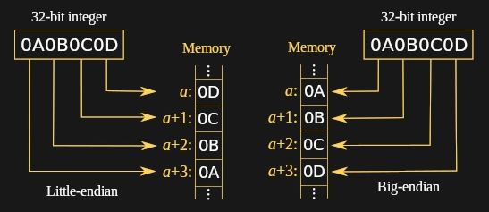

# C Bitwise Operations

`bitwise_ops.c` handles the 6 implemented bitwise operators in C.

- `>>`	Shift Right,
- `<<`	Shift Left,
- `~`	NOT,
- `&`	AND,
- `|`	OR,
- `^`	XOR

| Category | Operator | Associativity |
| :------------ |:---------------:| -----:|
| Postfix	      |     () [] -> . ++ - -                   |Left to right|
| Unary         |   + - ! ~ ++ - - (type)* & sizeof      |Right to left|
| Multiplicative|   * / %	                               |Left to right|
| Additive     |   + -                               |Left to right|
| Shift         |   << >>                               |Left to right|
| Relational   |     < <= > >=                           |Left to right|
| Equality    |   == !=                               |Left to right|
| Bitwise AND   |   &                               |Left to right|
| Bitwise XOR   |   ^                                  |Left to right|
| Bitwise OR  |       \|                               |Left to right|
| Logical AND  |       &&                               |Left to right|
| Logical OR  |       \|\|                               |Left to right|
| Conditional  |       ?:                               |Right to left|
| Assignment  |       = += -= *= /= %=>>= <<= &= ^= \|=   |Right to left|
| Comma        |     ,                               |Left to right|

`bin_ops.c` handles some useful general purpose binary Operations.  
inline ASM/INTEL shift and rotate (aka. circular shift) and setting bits
in a logical mannor - also called bit masking.

[Run this code:](https://ideone.com/e9iqwh)  

## Memory

At a high level memory is one large array. The array contains bytes. One uses addresses to refer to the arrays locations.
Each address stores one element of the memory array. Each element is typically one byte. In some memory configurations, each address stores something besides a byte. However, those are extremely rare so, for now, let’s make the broad assumption that all memory addresses store bytes.

## Data types

A binary cell can either be set or unset, meaning one cell can have 2 conditions.
- 8 bit can store 2^8 conditions, 0-255.
- 4 Bit are called a nibble. One hex value occupies a nibble.
- 8 Bit are called a byte. (2 hex values)

Interpretation, abstraction ...

Those 256 conditions can be given a meaning. One could map each condition to a color, resulting in a  color palette; each condition could stand for a person , or one could even mix that.

Mapping conditions to numbers is the first abstraction that happens on a machine.

For the representation of unsigned integers, it is common to map the conditions directly to integers. If the data-bucket should map to signed integeres (-1, -2 asf) we need have a marker if it is a negative number. One cell is enough to mark if it is a negative number, 7 left for payload, 2^7 = 128 conditions to represent 0, positive number from 1 to 127 and negative number from -1 to -128.

- `sizeof(char)` is guaranteed to be 1

Unless you're writing code on a DSP, [POSIX](https://pubs.opengroup.org/onlinepubs/9699919799/basedefs/stdint.h.html) and Windows have (and mandate) 8-bit bytes so a `char` in C is 1 byte.

## Byte Order and data representation in memory

### Endianness

The attribute of a system that indicates whether integers are represented with the most significant byte stored at the lowest address (big endian | BE) or at the highest address (little endian | LE).

Byte Order refers to the order where the most significant bytes come first (smallest memory address).
- Big endian MSB is left
- Little endian MSB is right
  
Big and little endian hardware store in memory their Most Significant Bytes (MSB) and Least Significant Byte (LSB) in an order opposite from each other.

Thus data exchange between big and little endian systems, including translation to the network big endian byte order, often requires endian conversion achieved by byte swapping the data.

### Registers and Endianess

The rightmost bit is the least significant bit, and the leftmost bit is the most significant bit.
Some people classify a register as a big-endian, because it stores its most significant byte at the lowest memory address.

32-Bit Register, smallest value on the right:

00000000 00000000 00000000 00000001

## Network Byte Order

Big endian byte ordering has been chosen as the "neutral" or standard for network data exchange and thus Big Endian byte ordering is also known as the "Network Byte Order". Thus Little Endian systems will convert their internal Little Endian representation of data to Big Endian byte ordering when writing to the network via a socket. This also requires Little Endian systems to swap the byte ordering when reading from a network connection. Languages such as Java manage this for you so that Java code can run on any platform and programmers do not have to manage byte ordering.

It is important to observe Network Byte Order not just to support heterogeneous hardware but also to support heterogeneous languages.

## Byte Swapping

Byte-swapping consists of masking each byte and shifting them to the correct location.

Many compilers provide built-ins that are likely to be compiled into native processor instructions (bswap/movbe), such as `__builtin_bswap32`. Software interfaces for swapping include:

- Standard network endianness functions (from/to BE, up to 32-bit). Windows has a 64-bit extension in winsock2.h.

- BSD and Glibc `endian.h` functions (from/to BE and LE, up to 64-bit).

- macOS `OSByteOrder.h` macros (from/to BE and LE, up to 64-bit).
### ASM

INTEL  
`BSWAP` (ASM mnemonic)  
`BSWAP r32` - Reverses the byte order of a 32-bit register.  
`BSWAP r64` - Reverses the byte order of a 64-bit register.  

Opcode: `0FC8 + Register`  

This instruction is provided for converting little-endian values to big-endian format and vice versa. To swap bytes in a word value (16-bit register), use the `XCHG` instruction.

### 32-Bit Integer example

`sizeof(unsigned int); // 4 Bytes`  
`unsigned int x = 16909060;`

BE Byte-Order: `01` `02` `03` `04` = `0x01` `0x02` `0x03` `0x04`  
LE Byte-Order: `04` `03` `02` `01` = `0x04` `0x03` `0x02` `0x01`

**Addresses of the image and the text are not the same.**

### Mixed-endian

Mixed-endian or middle endian (e.g. PDP-11):  
ME Byte-Order: `02` `01` `04` `03` = `0x02` `0x01` `0x04` `0x03`  

A 32-bit number is converted from Big Endian to Mid-Little Endian as follows:

divide the 4 bytes in half and convert the halves to Little Endian by reversing their order.

For example, `01` `02` `03` `04` in Mid-Little Endian is `03` `04` `01` `02`.

The same number is converted to Mid-Big Endian as follows:

1. convert the number to LE (reverse the order of the 4 bytes),
2. divide the bytes in two, and
3. reverse the order of the halves.

For example, `01` `02` `03` `04` in Mid-Big Endian is `02` `01` `04` `03`.

### Bi-endian

Some systems are capable of processing bi-endian data (BE and LE).

## Resources

- https://bitwisecmd.com/
- http://www.avr-asm-tutorial.net/avr_en/binary/binary.html

- https://en.wikipedia.org/wiki/Endianness
- https://developer.ibm.com/technologies/systems/articles/au-endianc/
- https://www.ibm.com/support/pages/just-faqs-about-little-endian
- http://www.yolinux.com/TUTORIALS/Endian-Byte-Order.html

- [Bit Twiddling Hacks By Sean Eron Anderson](http://graphics.stanford.edu/~seander/bithacks.html)
- [Mark Down Version](https://github.com/gibsjose/BitHacks/blob/master/BitHacks.md)
- [Some Notes](https://www.cs.tau.ac.il/~roded/courses/softp-b06/chapter7.txt)
- [My C Snippets](https://gist.github.com/Acry/554e04bab3a2669a5ba2ecd4d673e875)
- [Other API's](https://acry.github.io/)  

## TODO

Make own example for endianess
