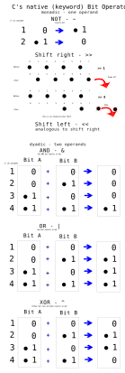

C Bitwise Operators
===================

And binary Operations.

  * bitwise_ops.c handles the 6 Operators.  
`>>	Shift Right,
<<	Shift Left,
~	NOT,
&	AND,
|	OR,
^	XOR`

  * bin_ops.c handles some useful general purpose binary Operations.  
inline ASM/INTEL shift and rotate (aka. circular shift) and setting bits
in a logical mannor - also called bit masking.  
[Run this code:](https://ideone.com/e9iqwh)  

ToDo:  
Applications: [Bit Twiddling Hacks
By Sean Eron Anderson](http://graphics.stanford.edu/~seander/bithacks.html) | 
[Mark Down Version](https://github.com/gibsjose/BitHacks/blob/master/BitHacks.md)  
    [My C Snippets](https://gist.github.com/Acry/554e04bab3a2669a5ba2ecd4d673e875) |
 [Other API's](https://acry.github.io/)  
